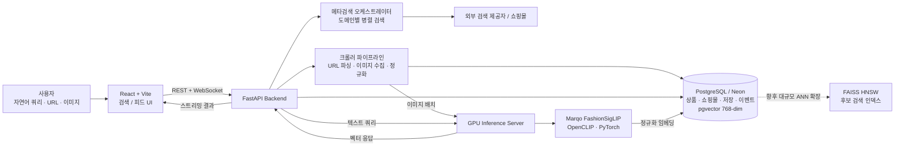

# POSE — 취향과 의미를 이해하는 패션 메타검색 엔진

> **"스트릿한 가죽자켓"처럼 모호한 문장도, 유저의 저장·클릭 맥락과 패션 멀티모달 임베딩을 결합해 탐색 가능한 상품으로 연결합니다.**

[](https://www.python.org/)
[](https://fastapi.tiangolo.com/)
[](https://react.dev/)
[](https://www.postgresql.org/)
[](https://pytorch.org/)
[](https://alembic.sqlalchemy.org/)

## 문제와 해결 방식

| 사용자의 문제 | POSE의 접근 |
| --- | --- |
| “미니멀하지만 너무 딱딱하지 않은 출근룩”처럼 정확한 키워드로 쪼개기 어려운 요구 | 텍스트를 패션 멀티모달 임베딩으로 인코딩하여 이미지·상품 표현과 비교할 수 있는 검색 단위로 변환 |
| 쇼핑몰마다 흩어진 상품을 반복 탐색 | 사이트별 검색 요청을 병렬 처리하고, 결과를 WebSocket으로 순차 전달 |
| 발견한 취향이 다음 탐색에 이어지지 않음 | 상품과 Instagram 게시물을 개인 피드에 저장하고, 이벤트 로그와 저장 데이터를 관리 |
| 상품 정보가 자주 바뀌고 수집 실패 가능성이 있음 | URL 크롤링을 백그라운드 작업으로 분리하고, 정규화된 상품·쇼핑몰 스키마에 저장 |

## 핵심 기능

- **자연어 패션 검색** — 추상적인 분위기·상황·스타일 문장을 여러 쇼핑 도메인 검색 요청으로 확장합니다.
- **실시간 결과 스트리밍** — 쇼핑몰 단위의 검색 결과를 WebSocket으로 전달해, 모든 검색이 끝나기 전에 결과를 확인할 수 있습니다.
- **상품 URL 수집** — 사용자가 추가한 상품 URL에서 제목·가격·브랜드·카테고리·이미지를 추출해 개인 피드에 저장합니다.
- **이미지·텍스트 임베딩 API** — GPU 서버가 단건·배치 이미지 임베딩과 텍스트 임베딩을 제공하여 멀티모달 검색 기반을 만듭니다.
- **개인화 기반** — 저장 상품, 저장 게시물, 사용자 이벤트를 분리된 테이블로 관리해 취향 신호를 축적합니다.

## 시스템 아키텍처



### 검색 요청의 흐름

1. 사용자가 자연어 쿼리를 입력하면 프론트엔드가 FastAPI 검색 엔드포인트에 요청합니다.
2. 백엔드는 쇼핑 도메인별 질의를 비동기로 실행하고, 도착한 상품을 사용자별 WebSocket 연결로 전달합니다.
3. 상품 URL을 저장하는 경우 백그라운드 크롤러가 상품 메타데이터와 이미지를 정규화합니다.
4. GPU 서버는 FashionSigLIP으로 텍스트 또는 이미지 임베딩을 생성합니다. 상품 모델에는 768차원 제목·이미지 벡터 컬럼이 준비되어 있습니다.
5. PostgreSQL/pgvector에 저장된 상품·저장·이벤트 데이터가 개인화와 후속 벡터 검색의 기반이 됩니다.

## 기술 선택과 엔지니어링 포인트

| 영역 | 선택 | 의도 |
| --- | --- | --- |
| API / 실시간 전달 | FastAPI, WebSocket, `BackgroundTasks` | I/O 중심 크롤링·검색 작업을 요청 처리와 분리하고 결과를 점진적으로 전달 |
| 멀티모달 모델 | PyTorch, OpenCLIP, Marqo FashionSigLIP | 텍스트와 이미지에 공통 표현 공간을 제공해 추상적 패션 의도를 다룰 수 있게 함 |
| 데이터 | PostgreSQL (Neon), SQLAlchemy, pgvector | 상품 메타데이터와 768차원 벡터를 함께 관리하고 관계형 무결성을 유지 |
| 수집 | `httpx`, Beautiful Soup, `nodriver`, `curl_cffi` | 쇼핑 페이지의 다양한 렌더링·응답 형태에 대응하는 수집 기반 |
| 스키마 변경 | Alembic | 초기 스키마와 후속 변경을 코드로 검토·재현 가능한 형태로 관리 |
| 클라이언트 | React, TypeScript, Vite, Tailwind CSS | 검색·피드 상호작용을 빠르게 제공하는 타입 기반 프런트엔드 |

## 현재 프로젝트 구조

> 현재 디렉터리 구조를 기준으로 역할을 정리했습니다. 코드를 예시 구조에 맞춰 이동시키지 않았습니다.

```text
.
├── README.md
├── Justfile                         # 로컬 서비스 실행 명령
├── brand_db/                        # 브랜드·패션 키워드 데이터 정리 스크립트 및 원본 파일
├── crawl4shopping/                  # 쇼핑몰별 독립 크롤링 실험/수집 스크립트
└── project/
    ├── backend/
    │   ├── main.py                  # FastAPI 애플리케이션 진입점
    │   ├── app/
    │   │   ├── api/                 # 인증·콘텐츠 HTTP/WebSocket 라우트
    │   │   ├── services/            # 검색, 크롤링, 콘텐츠, WebSocket 오케스트레이션
    │   │   ├── repositories/        # 사용자·상품·저장·이벤트 데이터 접근 계층
    │   │   ├── db/                  # SQLAlchemy 모델, 세션, pgvector 컬럼 정의
    │   │   └── manage/              # 설정, DB 수명주기, 복원력 관련 코드
    │   ├── basic_functions/         # 크롤러, 검색 유틸리티, GPU 서버 연동
    │   ├── migrations/              # Alembic 베이스라인 및 이후 마이그레이션
    │   ├── tests/                   # 임베딩·이미지 처리 실험/검증 코드
    │   ├── requirements.txt         # Python 런타임 의존성
    │   └── .env.example             # 백엔드 환경 변수 템플릿
    ├── frontend/
    │   ├── src/                     # React 화면, 검색·피드 컴포넌트, API hooks
    │   ├── public/                  # 정적 에셋
    │   └── package.json             # 프런트엔드 의존성 및 실행 스크립트
    └── gpu_server/
        ├── main.py                  # GPU FastAPI 서버 진입점·모델 수명주기
        ├── routes.py                # 이미지/텍스트 단건·배치 임베딩 API
        └── embedding_reranking.py   # FashionSigLIP 로딩, 전처리, 임베딩 구현
```

## 빠른 시작

### 1) 사전 요구 사항

- Python **3.10 이상**
- Node.js **18 이상** 및 npm
- PostgreSQL(Neon 포함) 데이터베이스와 `pgvector` 확장
- GPU 추론을 사용할 경우 PyTorch 호환 CUDA 환경 권장 — CPU로도 실행되지만 모델 초기화·추론이 느릴 수 있습니다.
- [`just`](https://github.com/casey/just) (선택) — 아래의 세 서비스를 간단히 실행하는 명령 러너입니다.

### 2) 저장소 설치 및 환경 변수 설정

```bash
git clone <YOUR_REPOSITORY_URL>
cd POSE

python -m venv .venv
source .venv/bin/activate              # Windows: .venv\Scripts\activate
pip install -r project/backend/requirements.txt

cp project/backend/.env.example project/backend/.env
cd project/frontend && npm ci && cd ../..
```

`project/backend/.env`에 아래 값을 채웁니다. 서비스별로 필요한 외부 키만 발급해 설정하면 됩니다.

```dotenv
# 필수: 애플리케이션 DB 연결
NEON_DB_URL=postgresql://<user>:<password>@<host>/<database>

# 검색 / 인증 / 외부 연동에 필요한 값
SERP_API_KEY=
GOOGLE_API_KEY=
GOOGLE_CLIENT_ID=
JWT_SECRET=
SUPABASE_URL=
SUPABASE_KEY=

# 로컬 서비스 연결
BACKEND_PORT=8000
GPU_SERVER_URL=http://localhost:8001
BASE_PROXY_URL=
```

> `.env`는 Git으로 추적하지 않습니다. 실제 비밀값을 커밋하지 말고, 공유 가능한 키 이름만 `.env.example`에 유지하세요.

### 3) 데이터베이스 마이그레이션

Alembic은 런타임의 `NEON_DB_URL`과 별도로 `ALEMBIC_DATABASE_URL`을 요구합니다. 이 분리는 로컬 명령이 운영 DB에 실수로 연결되는 위험을 줄이기 위한 장치입니다.

```bash
export ALEMBIC_DATABASE_URL="$NEON_DB_URL"
alembic -c project/backend/alembic.ini upgrade head
```

기존 데이터베이스에 베이스라인을 단순 stamp하지 말고, 빈 DB/브랜치에서 먼저 적용·검증하세요. 스키마 변경을 만들고 검토하는 절차는 [마이그레이션 가이드](project/backend/MIGRATIONS.md)를 참고하세요.

### 4) 로컬 실행

세 개의 터미널에서 다음 서비스를 실행합니다.

```bash
# Terminal 1 — Backend API: http://localhost:8000
just backend

# Terminal 2 — GPU embedding API: http://localhost:8001
just gpu_server

# Terminal 3 — Frontend: http://localhost:3000
just frontend
```

`just`가 없다면 동일한 명령을 직접 실행할 수 있습니다.

```bash
# backend
BACKEND_PORT=8000 uvicorn project.backend.main:app --reload --host 0.0.0.0 --port 8000

# gpu server
GPU_SERVER_PORT=8001 uvicorn project.gpu_server.main:app --host 0.0.0.0 --port 8001

# frontend (새 터미널)
cd project/frontend && npm run dev
```

모든 서비스를 동시에 실행하려면 `just all`을 사용할 수 있습니다. GPU 서버는 첫 기동 시 Hugging Face 모델 캐시를 확인하며, 캐시가 없으면 모델 다운로드가 필요할 수 있습니다.

## API 표면

인증이 필요한 엔드포인트는 로그인 토큰이 필요합니다. 주요 콘텐츠 API는 다음과 같습니다.

| 목적 | 메서드 / 경로 | 비고 |
| --- | --- | --- |
| URL 상품 수집 | `POST /api/crawl_product` | 백그라운드 수집 후 WebSocket 이벤트 전달 |
| 메타검색 실행 | `POST /api/pse` | 쇼핑 도메인별 검색 결과 스트리밍 |
| 저장 상품 조회 | `GET /api/items` | 현재 사용자 피드 |
| 상품 DB 제목 검색 | `GET /api/product_db/search?query=...` | 최대 결과 수 `limit` 지원 |
| 이미지 기반 탐색 | `POST /api/lens` | 이미지 파일 및 선택적 텍스트 쿼리 |
| 임베딩 생성 | `POST /embedding`, `POST /encode_text` | GPU 서버 API; 배치 엔드포인트도 제공 |

## 협업과 변경 관리

- `main`에는 검증된 변경만 병합합니다. 기능 단위 브랜치(`feat/...`, `fix/...`, `docs/...`)에서 작업하고 Pull Request로 리뷰 가능한 변경 단위를 남깁니다.
- 스키마 변경은 모델 수정만으로 끝내지 않고 Alembic revision을 함께 추가합니다. 자동 생성 결과와 생성 SQL을 검토한 뒤, disposable DB → staging → production 순으로 적용합니다.
- 크롤러·모델·검색 품질 변경은 입력 샘플, 기대 결과, 실행 환경을 PR 본문에 기록해 재현 가능한 논의를 만듭니다.

## 확장 로드맵

- `pgvector`에 축적되는 임베딩을 기반으로 **FAISS HNSW** 후보 검색 계층을 도입해 대규모 상품 카탈로그의 지연 시간을 낮춥니다.
- 저장·클릭·구매 의도 신호를 학습 데이터로 정리해 사용자 타워와 상품 타워를 분리한 **Two-Tower 개인화 랭커**로 확장합니다.
- 오프라인 검색 품질셋과 랭킹 지표를 추가해 자연어 패션 쿼리의 품질을 지속적으로 측정합니다.

## 라이선스

별도 라이선스가 명시되지 않은 저장소입니다. 사용·배포 조건은 프로젝트 소유자에게 문의해 주세요.
